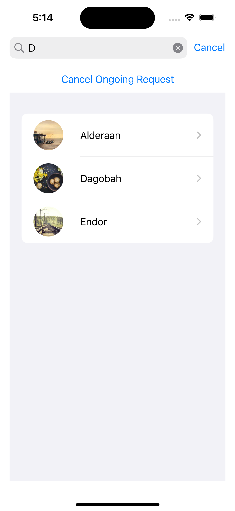
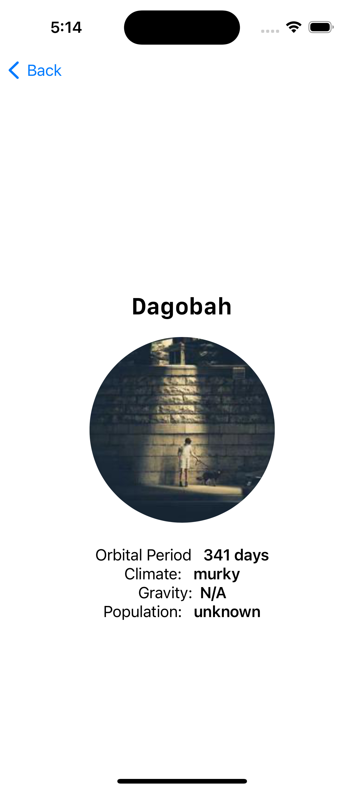
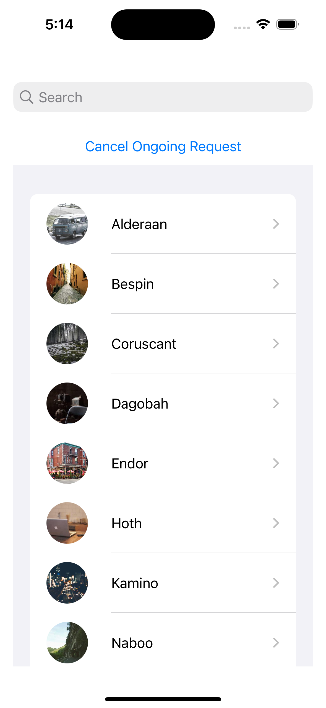

<h1 align="center">{ 🪐 Planets 💻 App 📱 }</h1>

# Architecture
This application uses MVVM

# Design Patterns
Combine Framework to handle asynchronous tasks .

# Testing
Units tests for success and failure situations.Mocked responses using FakeNetworkManager, and Jsons to replicate data from API

# Screenshots

